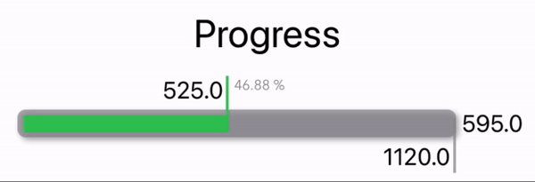

# ProgressBar with vertical Divider

A simple example of the custom ProgressBar with a vertical Divider!



# Using
```swift
ProgressBarValue(plannedValue: .constant(1000), progressValue: .constant(600))
```

